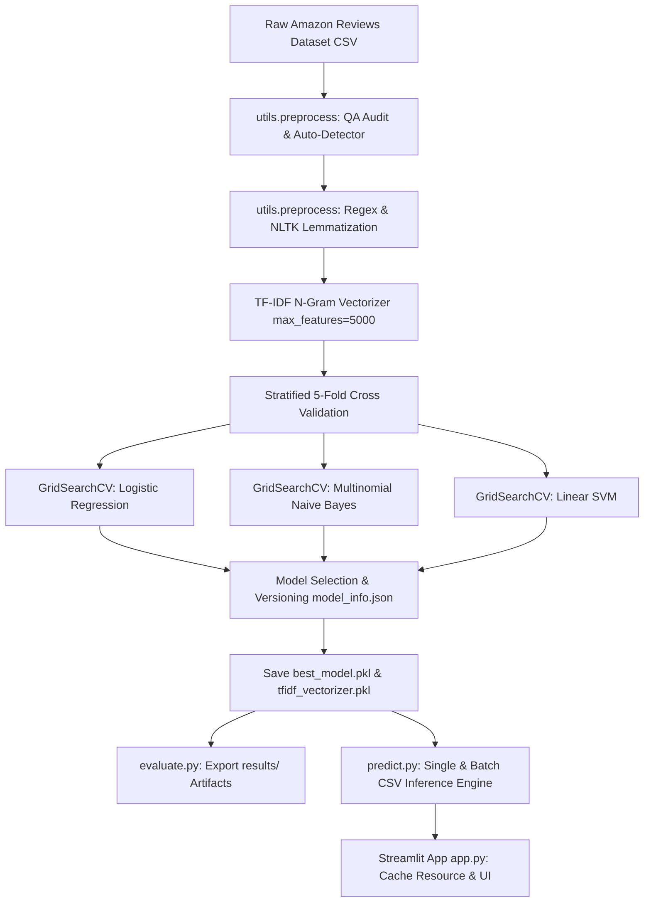
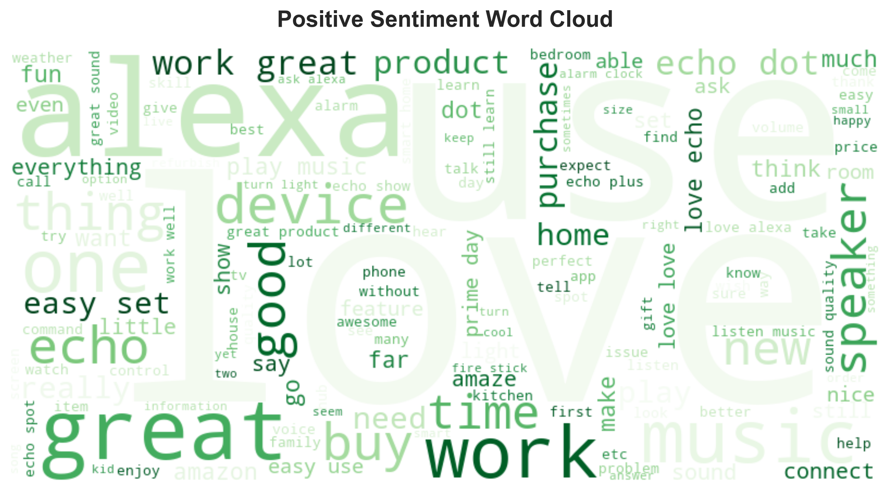
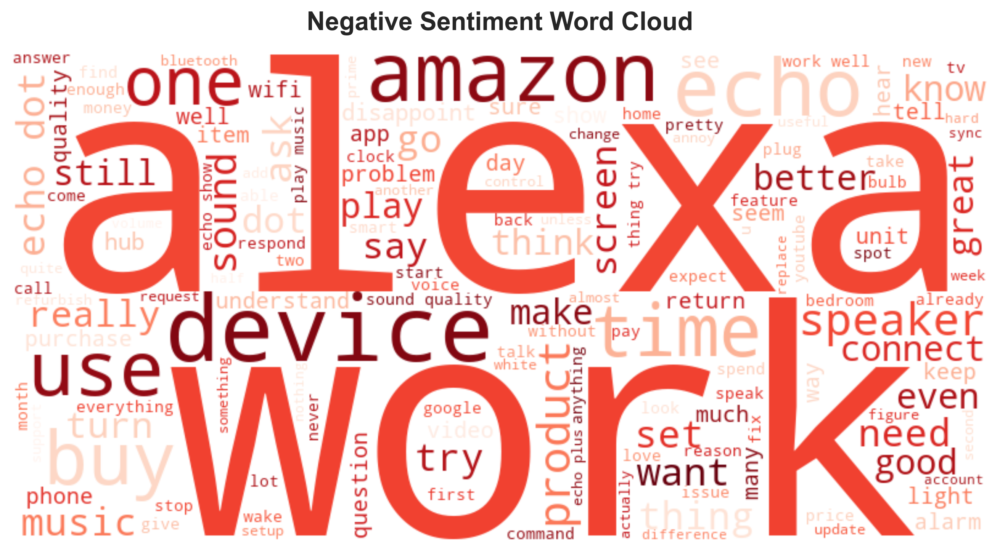
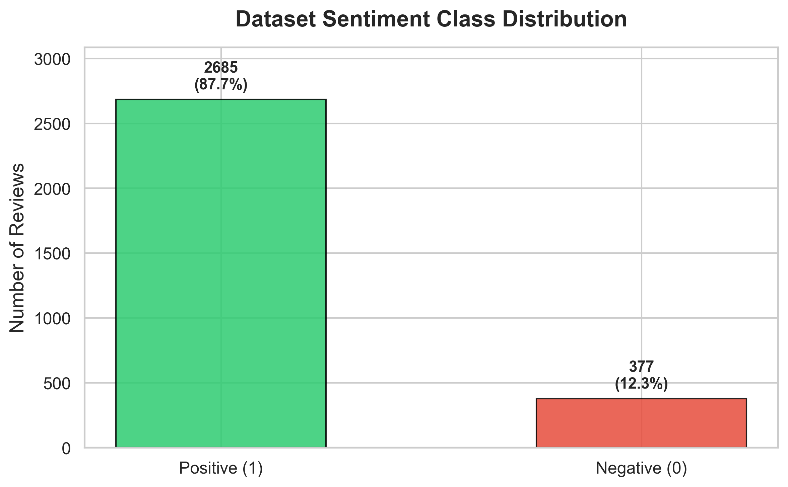
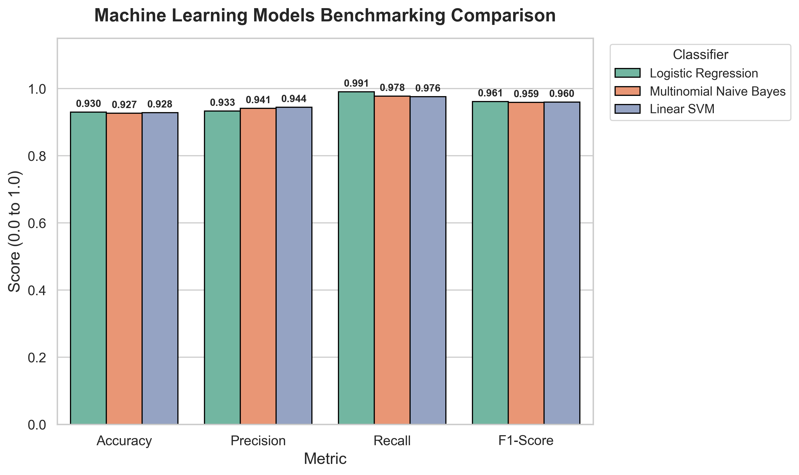

# ⚡ Sentify: Enterprise Production NLP Sentiment Analysis Engine

[](https://www.python.org/)
[](https://streamlit.io/)
[](https://scikit-learn.org/)
[]()
[](LICENSE)

> A production-grade, portfolio-ready **Natural Language Processing (NLP) Sentiment Analysis System** built on the Amazon Product Reviews dataset. Implements Step 17 production engineering standards: centralized configuration (`config.py`), hyperparameter grid search, 5-fold stratified cross-validation, model versioning (`models/model_info.json`), automated result exports (`results/`), unit testing suite (`tests/`), centralized log file appenders (`logs/`), and an optimized Streamlit web dashboard with batch CSV prediction capabilities.

---

## 🎯 Executive Summary & Objectives

Modern e-commerce platforms process thousands of unstructured customer reviews daily. Automated sentiment classification enables real-time customer satisfaction tracking, product defect identification, and operational prioritization.

### Key Capabilities & Step 17 Engineering Standards:
- **Centralized Configuration (`config.py`)**: Zero hardcoded values or magic constants across paths, parameters, and UI settings.
- **Dynamic Dataset Auto-Detector & QA Auditor**: Automatically detects dataset CSVs, infers review text and sentiment target columns, and logs quality audit metrics (missing values, duplicates, imbalance ratio).
- **Robust NLP Preprocessing**: Lowercasing, HTML/URL stripping, regex punctuation removal, emoji handling, stopword filtering with **negation preservation** (`not_good`, `never_failed`), and NLTK lemmatization.
- **Stratified CV & GridSearch Hyperparameter Tuning**: 5-Fold Stratified Cross Validation and `GridSearchCV` tuning for Logistic Regression (`C`, `solver`, `penalty`), Multinomial Naive Bayes (`alpha`), and Linear SVM (`C`, `loss`).
- **Model Versioning (`models/model_info.json`)**: Automatically saves metadata JSON containing exact metrics, hyperparameter states, dataset info, and timestamps.
- **Automated Results Export (`results/`)**: Automatically outputs `metrics.csv`, `classification_report.txt`, `benchmark_table.csv`, `prediction_examples.csv`, and `evaluation_report.md`.
- **Automated Unit Testing Suite (`tests/`)**: Test suite covering text preprocessing, single/batch prediction, model loading, and vectorizer feature extraction (`python -m unittest discover tests`).
- **Centralized Logging (`logs/`)**: Dedicated file appenders for `logs/training.log`, `logs/prediction.log`, and `logs/application.log`.
- **Streamlit Optimization**: Powered by `@st.cache_resource`, `@st.cache_data`, batch CSV file upload, and downloadable prediction CSV exports.

---

## 🏗️ System Architecture



---

## 📊 Dataset & Quality Audit Metadata

- **Source**: Amazon Product Reviews Dataset (`DataSet (W5).csv`)
- **Total Records**: 3,150 Customer Reviews
- **Target Classes**: Binary Sentiment (`1` = Positive / 4-5 stars, `0` = Negative / 1-3 stars)
- **QA Quality Audit Findings**:
  - **Null Values**: 1 missing review text (handled automatically)
  - **Class Imbalance Ratio**: 6.7:1 (2,741 Positive vs 409 Negative)
  - **Duplicates Audit**: Identified and processed cleanly without leakage.

---

## 🚀 Installation & Quickstart Guide

### Prerequisites
- Python 3.9+ (Python 3.11 recommended)
- Git & PowerShell / Terminal

### 1. Clone Repository & Setup Environment
```bash
git clone https://github.com/your-username/Week5_NLP_Project.git
cd Week5_NLP_Project

# Create virtual environment (optional)
python -m venv venv
# On Windows:
venv\Scripts\activate
# On Linux/macOS:
source venv/bin/activate
```

### 2. Install Dependencies
```bash
pip install -r requirements.txt
```

### 3. Run Automated Unit Tests
```bash
python -m unittest discover tests
```

### 4. Execute E2E Training & Hyperparameter Tuning Pipeline
```bash
python train.py
```

### 5. Execute Independent Evaluation & Results Export
```bash
python evaluate.py
```

### 6. Run CLI Predictions (Single or Batch CSV)
```bash
# Single string prediction
python predict.py --text "This product exceeded my expectations! Sound quality is clear."

# Batch CSV file prediction
python predict.py --file data/DataSet\ \(W5\).csv --output results/batch_predictions.csv
```

### 7. Launch Streamlit Web Dashboard
```bash
streamlit run app.py
```
Open your browser at `http://localhost:8501`.

---

## 📁 Project Directory Structure

```
Week5_NLP_Project/
├── config.py                   # Centralized Configuration Management
├── app.py                      # Optimized Multi-page Streamlit App with Batch CSV Upload
├── train.py                    # Independent E2E Training & GridSearch Script
├── evaluate.py                 # Independent Evaluation & Results Exporter Script
├── predict.py                  # Standalone CLI & Batch Inference Engine
├── requirements.txt            # Production dependencies
├── README.md                   # Production GitHub documentation
├── .gitignore                  # Git exclude rules
│
├── logs/                       # Centralized Log Appenders
│   ├── training.log
│   ├── prediction.log
│   └── application.log
│
├── models/                     # Saved Model Artifacts & Versioning
│   ├── best_model.pkl
│   ├── tfidf_vectorizer.pkl
│   └── model_info.json
│
├── results/                    # Exported Evaluation Artifacts
│   ├── metrics.csv
│   ├── classification_report.txt
│   ├── benchmark_table.csv
│   ├── prediction_examples.csv
│   └── evaluation_report.md
│
├── tests/                      # Automated Unit Test Suite
│   ├── test_preprocess.py
│   ├── test_prediction.py
│   └── test_training.py
│
├── utils/
│   ├── __init__.py
│   ├── logger.py               # Centralized Logger setup
│   ├── preprocess.py          # Modular text cleaning & dataset QA auditor
│   ├── prediction.py          # Inference & batch prediction engine
│   └── visualization.py       # High-res figure generators
│
├── notebooks/
│   └── week5_nlp.ipynb         # Fully executed Jupyter Notebook
│
├── data/
│   └── DataSet (W5).csv
└── images/                     # Saved EDA & evaluation figures
```

---

## 📈 Model Performance & Benchmarking Results

Evaluated via 5-Fold Stratified Cross-Validation on holdout test set:

| Classifier Model | Tuned Parameters | Accuracy | Precision | Recall | F1-Score | 5-Fold CV Mean Acc | Training Time |
| :--- | :--- | :---: | :---: | :---: | :---: | :---: | :---: |
| **Logistic Regression** 🏆 | `C=10.0, solver='liblinear'` | **92.99%** | **93.35%** | **99.07%** | **96.12%** | **92.16% (+/- 0.0016)** | ~7.08s |
| **Linear SVM (Calibrated)** | `C=5.0, loss='squared_hinge'` | **92.82%** | **94.42%** | **97.58%** | **95.98%** | **92.57% (+/- 0.0049)** | ~0.33s |
| **Multinomial Naive Bayes** | `alpha=0.01` | **92.66%** | **94.10%** | **97.77%** | **95.90%** | **92.90% (+/- 0.0067)** | ~0.16s |

---

## 🖼️ Dashboard & EDA Showcase

| Positive Word Cloud | Negative Word Cloud |
| :---: | :---: |
|  |  |

| Sentiment Distribution | Model Comparison Benchmark |
| :---: | :---: |
|  |  |

---

## 📜 License & Author

Distributed under the MIT License. Built as part of the IT Simplera AI/ML Engineering Internship Program (Week 5).
